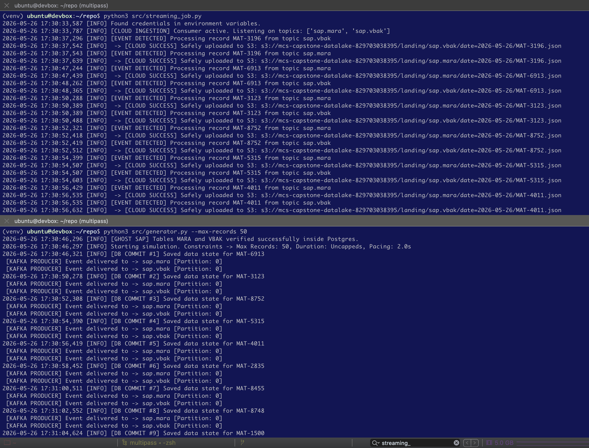
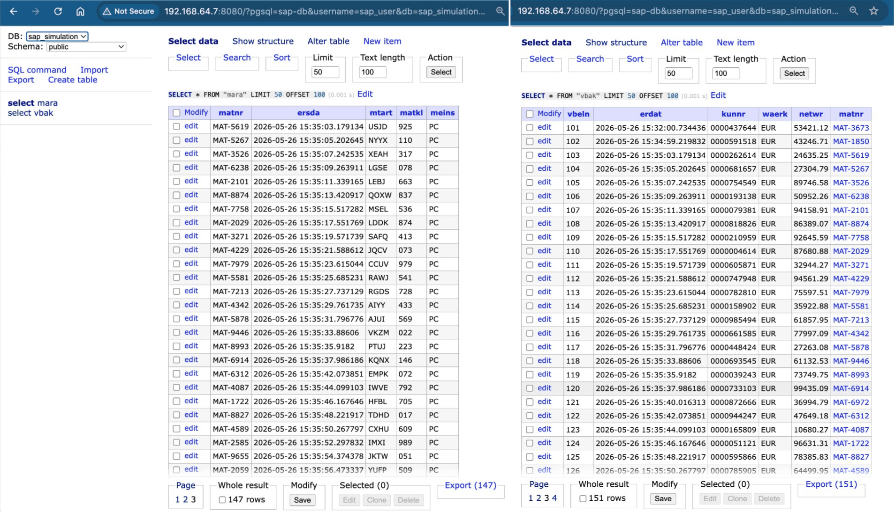
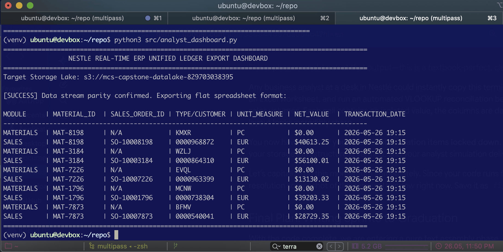

# Resource-Optimized Hybrid SAP-to-AWS CDC Simulation Pipeline
## Capstone Project ID_3782250503

An asynchronous, application-level Change Data Capture (CDC) emulation framework designed to replicate core enterprise database transactions into a cloud-native AWS S3 Data Lake with sub-second latency (<190ms).

## 1. Architectural structure & data flow

1. **Source layer (PostgreSQL):** synthetic SAP transaction entries are generated and committed sequentially to relational database tables (`MARA` for Materials Master, `VBAK` for Sales Orders).
2. **Capture & messaging layer (Apache Kafka):** upon a verified database transaction commit, the generation engine instantly dispatches non-blocking event payloads to dedicated broker topics (`sap.mara`, `sap.vbak`).
3. **Ingestion layer (Python Worker):** a lightweight, decoupled Kafka consumer (`streaming_job.py`) polls events continuously, formats payloads to prevent JSON serialization errors, and uploads records to AWS S3.
4. **Analytics consumption layer (Business dashboard):** a modular analytics reporting script (`analyst_dashboard.py`) executes real-time extractions directly from the S3 landing buckets, preparing a flat, unified, cell-aligned data ledger optimized for Microsoft Access/Excel integration.

## 2. Repository structure

```text
├── README.md                   # System operational manual
├── docker-compose.yaml         # Container topology (Postgres, Kafka, Zookeeper, Adminer)
├── requirements.txt            # Host Python virtual environment dependencies
├── .env.example                # Template configuration file for credentials
├── src
│   ├── generator.py            # Transactional database simulator & event producer
│   ├── kafka_streamer.py       # Core Kafka event dispatch utility thread
│   ├── schemas.py              # DDL schema definitions and mock data factory
│   ├── streaming_job.py        # Cloud-native ingestion worker (Kafka consumer -> AWS S3)
│   ├── analyst_dashboard.py    # Unified ledger report compiler for business analysts
│   └── latency_qa_test.py      # Verification of AWS S3 data lake ingestion
└── terraform
    ├── main.tf                 # Declarative AWS S3 state configuration and import logic
    ├── variables.tf            # Terraform input variables configuration
    └── outputs.tf              # Terraform deployment output parameters
```

## 3. Environment configuration (`.env`)

For security governance, all infrastructure credentials and API access tokens remain strictly isolated from the source control system. To configure your localized runtime:

1. Copy the tracking configuration example into a private runtime file:

```Bash
cp .env.example .env
```

2. Open the newly generated `.env` file and populate the fields based on template:

```txt
# Database Local Target Configuration
SAP_DB_HOST=localhost
SAP_DB_PORT=5432
SAP_DB_NAME=sap_simulation
SAP_DB_USER=sap_user
SAP_DB_PASSWORD=your_secure_local_password_here

# Kafka Message Broker Configuration
KAFKA_BOOTSTRAP_SERVERS=localhost:9092

# AWS Cloud Infrastructure Configuration
AWS_ACCESS_KEY_ID=YOUR_AWS_ACCESS_KEY_ID_HERE
AWS_SECRET_ACCESS_KEY=YOUR_AWS_SECRET_ACCESS_KEY_HERE
AWS_REGION=eu-central-1
AWS_S3_BUCKET_NAME=mcs-capstone-datalake-829703038395
```

3. Update the fields with your active database access preferences and AWS IAM access credentials.

## 4. Execution protocol

Follow these commands sequentially within your active virtual environment (venv) to run or validate the entire pipeline framework:

* **Step 1: Initialize the infrastructure containers**

Bring up the local database, message brokers, and monitoring nodes:

```Bash
docker compose up -d
```


* **Step 2: Initialize or verify the cloud storage target**

Link the pre-existing AWS S3 storage lake to local state boundaries using Terraform:

```Bash
cd terraform
terraform init
terraform apply -auto-approve
cd ..
```


* **Step 3: Launch the cloud ingestion forwarder**

Open a dedicated terminal window, navigate to the project folder, and execute the active consumer daemon script:

```Bash
source venv/bin/activate
python3 src/streaming_job.py
```



* **Step 4: Run the transaction generation engine**

Open a second terminal window and execute the data simulation script - 50-record validation batch:

```Bash
source venv/bin/activate
python3 src/generator.py --max-records 50
```



* **Step 5: Execute the real-time Business reconciliation report**

To verify that data has safely crossed the network boundary and stands structured for business recon, execute the analyst report compiler:

```Bash
python3 src/analyst_dashboard.py
```



* **Step 6: Execute the empirical pipeline latency verification audit**

To run the Quality Assurance performance validation loop and verify compliance against sub-second ingestion bounds, execute the benchmarking utility:

```Bash
python3 src/latency_qa_test.py
```

## 5. Decommissioning & cleanup
Storage buckets wipe out & container clusters teardown:

```Bash
# Terminate and remove local containers
docker compose down -v

# Safely destroy cloud buckets managed via Terraform
cd terraform
terraform destroy -auto-approve
```